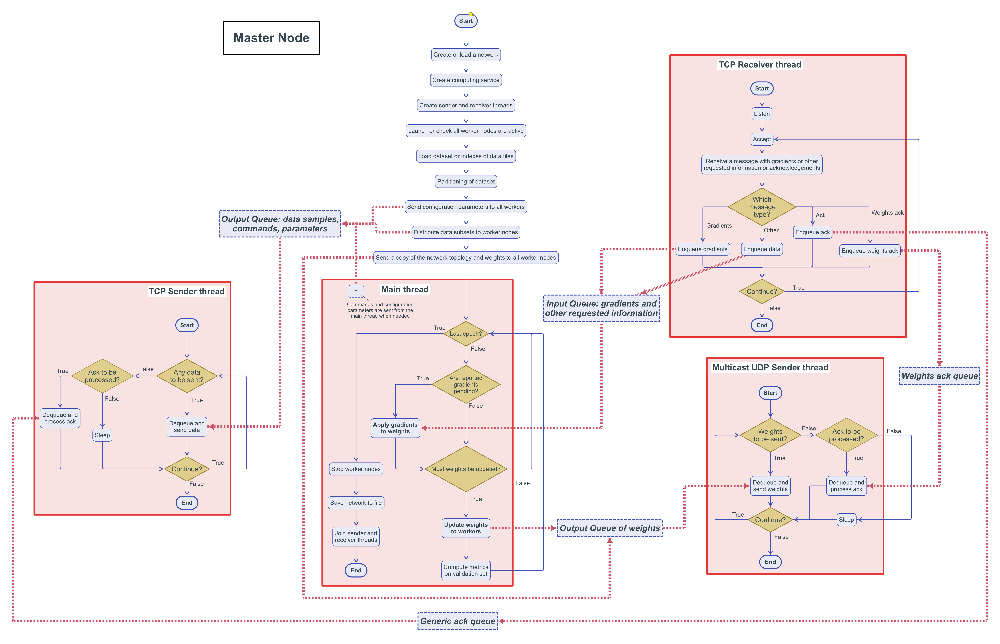
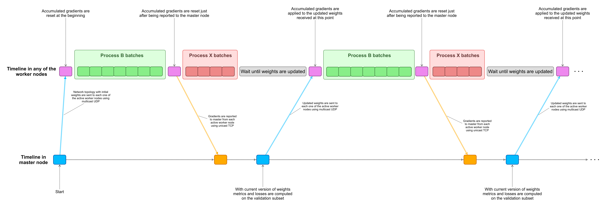

  

This specific section presents and describes the communication system of EDDL developed *ad hoc* to run training procedures in a distributed way.

## Notice

**This is very draft version, not ready to be used or tested**

## EDDL communication system

### The following figures give a general overview of the communication system:

- Diagram of the communication system for the EDDL: 
- Flowchart of the Master node: 
- Flowchart of Worker nodes: 
- Timeline of network parameters interchange between master node and worker nodes: 

## Progress and coverage

**Not available yet for the communication system**

